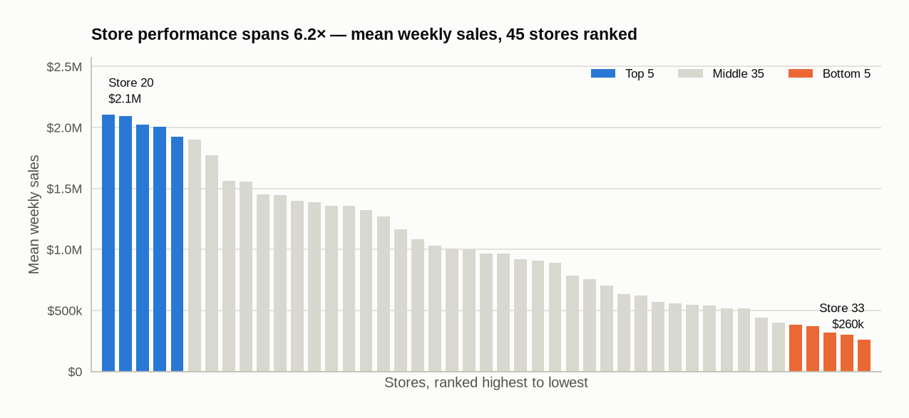
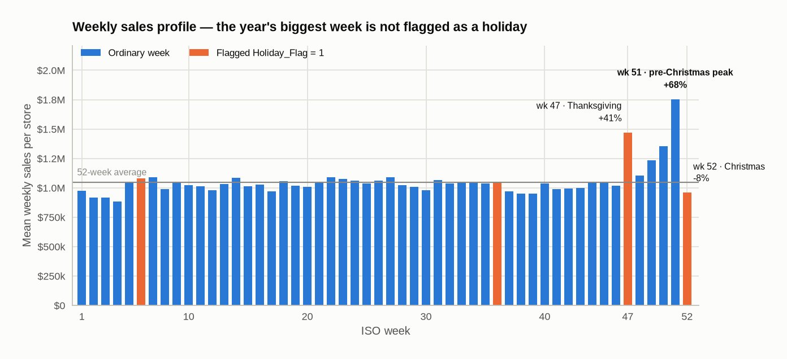
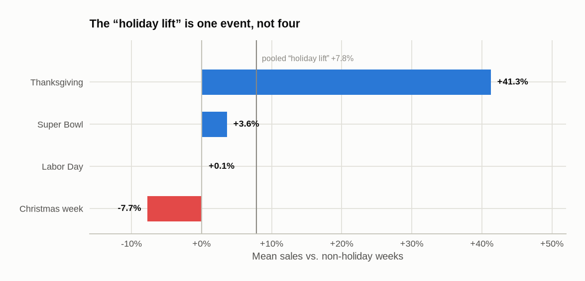
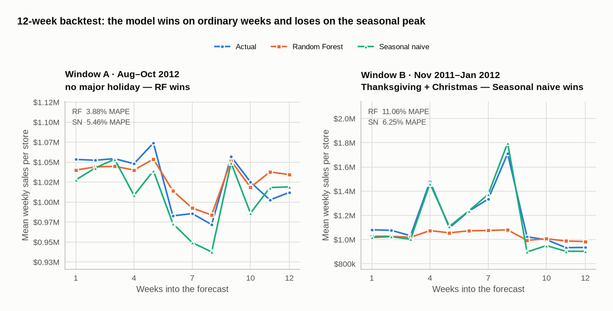
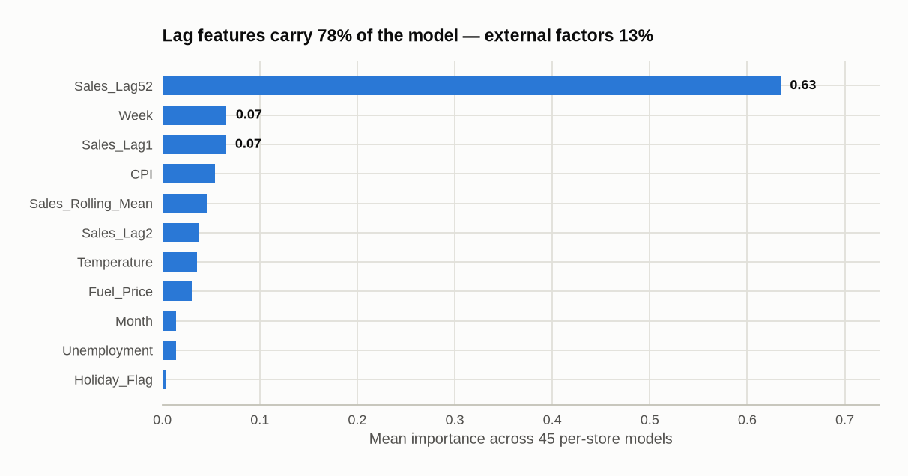

# Retail Pulse — Forecasting Walmart Weekly Sales

**Author:** Tapan Khaladkar
**Dataset:** 45 Walmart stores, weekly sales, 2010-02-05 → 2012-10-26

---

## Executive summary

A per-store Random Forest forecasts weekly sales at **3.88% MAPE** on ordinary trading
weeks, a 29% improvement on the best naive baseline. On the **holiday peak it fails**,
scoring 11.06% against seasonal naive's 6.25%.

The cause is a data limitation rather than a modelling defect: the dataset contains only
**two** November–December periods, so any holdout beginning in November leaves no prior
holiday season in training. The model has never observed the pattern it is asked to predict.

**Recommendation:** use the Random Forest for ordinary weeks and seasonal naive for ISO
weeks 47–52. Revisit with 4–5 years of history, at which point the year-over-year feature
would have enough holiday seasons to learn from.

| Window | Naive | Seasonal naive | Random Forest |
|---|---|---|---|
| **A** — Aug–Oct 2012 (no major holiday) | 6.01% | 5.46% | **3.88%** ✅ |
| **B** — Nov 2011–Jan 2012 (Thanksgiving + Christmas) | 13.79% | **6.25%** ✅ | 11.06% |

*MAPE, lower is better.*

---

## 1. Problem statement and objective

A retail chain with multiple outlets is struggling to match inventory to demand. The
objective is to analyse historical weekly sales, identify the factors that drive them, and
forecast the next 12 weeks per store to support inventory planning.

Specific objectives:

1. Exploratory data analysis
2. Data cleaning and preprocessing
3. Sales forecasting and predictive modelling
4. Derived business insight

---

## 2. Data

`Walmart.csv` — 6,435 rows × 8 columns. 45 stores, 143 consecutive weekly observations each,
every one a Friday. No missing values, no duplicate rows, and no gaps in any store's series.

| Feature | Description |
|---|---|
| `Store` | Store identifier (1–45) |
| `Date` | Week of sales |
| `Weekly_Sales` | Sales for that store in that week |
| `Holiday_Flag` | 1 if the week contains a flagged holiday |
| `Temperature` | Regional temperature (°F) |
| `Fuel_Price` | Regional fuel cost |
| `CPI` | Consumer Price Index |
| `Unemployment` | Regional unemployment rate |

The panel is balanced and clean, which is unusual and worth stating: no imputation was
required, and the 143-week length per store is what ultimately constrains the modelling.

---

## 3. Exploratory findings

### 3.1 Store performance

Mean weekly sales vary **6.2×** between the top and bottom five stores.

| Rank | Top 5 | Mean weekly sales | | Bottom 5 | Mean weekly sales |
|---|---|---|---|---|---|
| 1 | Store 20 | $2,107,677 | | Store 33 | $259,862 |
| 2 | Store 4 | $2,094,713 | | Store 44 | $302,749 |
| 3 | Store 14 | $2,020,978 | | Store 5 | $318,012 |
| 4 | Store 13 | $2,003,620 | | Store 36 | $373,512 |
| 5 | Store 2 | $1,925,751 | | Store 38 | $385,732 |

<picture>
  <source media="(prefers-color-scheme: dark)" srcset="figures/store-performance-dark.png">
  
</picture>

Size is not the same as reliability. Ranked by coefficient of variation, the most
*consistent* stores are 37 (4.2%), 30 (5.2%) and 43 (6.4%) — all mid-to-small performers.
A planner optimising for predictable replenishment should treat these separately from the
high-volume, high-variance stores.

### 3.2 Seasonality

Sales peak sharply at the end of the year. December averages $1,281,864 per store-week
against January's $923,885. The weekly view is far more actionable than the monthly one:

| ISO week | Mean sales | vs. overall | Flagged holiday? |
|---|---|---|---|
| 47 (Thanksgiving) | $1,471,273 | **+40.5%** | Yes |
| 49 | $1,235,866 | +18.0% | No |
| 50 | $1,354,517 | +29.4% | No |
| 51 (pre-Christmas) | $1,754,774 | **+67.6%** | **No** |
| 52 (Christmas) | $960,833 | −8.2% | Yes |

<picture>
  <source media="(prefers-color-scheme: dark)" srcset="figures/weekly-seasonality-dark.png">
  
</picture>

**The single largest trading week of the year — week 51, at +67.6% — is not flagged as a
holiday, while Christmas week itself, which runs 8% *below* average, is.** Anyone using
`Holiday_Flag` as a demand signal without checking this will plan the peak backwards.

### 3.3 The holiday flag is not one effect

Pooled, holiday weeks run +7.8% above non-holiday weeks (Welch t-test, p = 0.0076). That
aggregate hides four unrelated events:

| Event | vs. non-holiday |
|---|---|
| Thanksgiving | **+41.3%** |
| Super Bowl | +3.6% |
| Labor Day | +0.1% |
| Christmas week | **−7.7%** |

<picture>
  <source media="(prefers-color-scheme: dark)" srcset="figures/holiday-decomposition-dark.png">
  
</picture>

Effectively the entire "holiday effect" is Thanksgiving. Treating the flag as a single
binary feature averages a +41% event together with a −8% one.

### 3.4 Outliers are the business, not noise

An IQR test flags 34 high outliers (0.53% of rows). Every one falls in ISO week 47, 49, 50
or 51 — Black Friday and the Christmas run-up. These are the most commercially important
observations in the dataset and were deliberately retained. Removing them would delete
precisely the demand the forecast exists to anticipate.

### 3.5 Economic factors: a caution

Overall correlations with weekly sales are weak: unemployment −0.106, CPI −0.073,
temperature −0.064. Per-store correlations are much larger and tempting to interpret — but
mostly should not be.

**Within any single store, CPI is a clock.** Mean correlation between CPI and time index is
**0.976**. Consequently a store's sales-vs-CPI correlation is almost entirely its
sales-vs-time trend: across the 45 stores, those two quantities correlate at **0.996**.

Store 36 illustrates the trap. Its sales correlate **+0.83** with unemployment — apparently
a store that thrives as unemployment rises. In fact its sales declined steadily over the
period (sales–time correlation −0.94) while regional unemployment also fell (−0.91). The
positive association is an artefact of two independent trends.

**No causal claim about CPI or unemployment is supportable from this dataset without
detrending.** The store-level correlations are reported here as descriptions of trend, not
as elasticities. Of 45 stores, 29 show negative and 16 positive sales–unemployment
correlation, which is close to what trend heterogeneity alone would produce.

---

## 4. Methodology

### 4.1 Features

- **Calendar:** `Month`, `Week` (ISO)
- **External:** `Temperature`, `Fuel_Price`, `CPI`, `Unemployment`, `Holiday_Flag`
- **Autoregressive:** `Sales_Lag1`, `Sales_Lag2`, `Sales_Rolling_Mean` (4-week), `Sales_Lag52`

Two deliberate choices:

`Sales_Rolling_Mean` is **shifted one week before the rolling window is applied**. An
unshifted `.rolling(4)` includes the current week and leaks 25% of the target into its own
predictor, inflating every score derived from it.

`Day_of_Week` is **excluded**. Every observation is a Friday, so it is constant in training
and carries no information.

### 4.2 Validation design

Training used a **chronological holdout**: fit on everything up to a cutoff, forecast the
following 12 weeks. A random train/test split would place future weeks in the training set
and is not a valid test of a forecaster.

Forecasts are **recursive multi-step** — each prediction is fed back as the next week's lag,
with calendar features advancing, exogenous values carried forward per store, and the
holiday flag taken from the real calendar.

Two windows were evaluated: the most recent 12 weeks, and the equivalent period a year
earlier, which contains Thanksgiving and Christmas. Both are scored against a naive baseline
(repeat last week) and a seasonal naive baseline (same week last year).

### 4.3 Model

`RandomForestRegressor`, 100 trees, trained separately per store.

A pooled model with `Store` as a feature was tested and rejected: it scored 5.91% MAPE
against 4.97% for per-store models on the same recursive task.

---

## 5. Results

| Window | Naive | Seasonal naive | Random Forest |
|---|---|---|---|
| **A** — Aug–Oct 2012 | 6.01% | 5.46% | **3.88%** |
| **B** — Nov 2011–Jan 2012 | 13.79% | **6.25%** | 11.06% |

<picture>
  <source media="(prefers-color-scheme: dark)" srcset="figures/backtest-dark.png">
  
</picture>

**Window A.** The model beats both baselines comfortably. On ordinary trading weeks it earns
its place.

**Window B.** The model loses decisively. It forecasts a near-flat ~$1.07M per store per week
through the entire run-up, missing Thanksgiving by −27% and the pre-Christmas peak by −37%.
It tracks only Christmas week itself (−3%) — the one week in the period that is *not*
elevated.

### 5.1 Feature importance

| Feature | Importance |
|---|---|
| `Sales_Lag52` | 0.634 |
| `Week` | 0.066 |
| `Sales_Lag1` | 0.065 |
| `CPI` | 0.054 |
| `Sales_Rolling_Mean` | 0.046 |
| remaining seven | < 0.04 each |

<picture>
  <source media="(prefers-color-scheme: dark)" srcset="figures/feature-importance-dark.png">
  
</picture>

Lag features account for **78%** of total importance; external factors (temperature, fuel,
CPI, unemployment) for **13%**. The model is fundamentally a smoothed-persistence forecaster
with a year-over-year anchor. This also settles a question the exploratory analysis could
not: the external economic variables contribute little predictive value, consistent with
§3.5's finding that their apparent correlations are largely trend.

### 5.2 Why the model fails at the peak

The dataset spans 143 weeks and contains **two** November–December periods (2010 and 2011).
Holding out from November 2011 leaves a training set running February–October 2011 — which
contains **no November or December at all**.

The model is being asked to predict a pattern it has never seen. `Sales_Lag52`, the one
feature that could anticipate the spike, is also the first casualty: computing a 52-week lag
discards the first year of every store's series, cutting training data from 129 to 39 weeks
per store in that window.

This is a limitation of the data, not of the algorithm. No amount of tuning fixes it.

---

## 6. Recommendations

**Operationally**

1. Use the Random Forest for ordinary weeks and **seasonal naive for ISO weeks 47–52**.
   Expected error is roughly 4% and 6% respectively.
2. **Do not use `Holiday_Flag` as a demand signal as supplied.** Replace it with named events
   — Thanksgiving is +41%, Christmas week is −8%, and the true peak in week 51 is unflagged.
3. Plan the peak from the weekly profile in §3.2, not from monthly averages, which smooth a
   +68% week into a +22% month.

**For the model**

4. Acquire 4–5 years of history. With more holiday seasons, `Sales_Lag52` becomes trainable
   for the peak and the picture may change entirely.
5. Treat the high-CV stores (20, 4, 14) and the low-CV stores (37, 30, 43) as separate
   planning problems.
6. Detrend before making any claim about CPI or unemployment elasticity.

**Further work**

7. Store clustering to segment locations by demand profile rather than raw volume.
8. Sequence models (LSTM, temporal attention) once the history supports them — they are not
   justified on 143 weeks.
9. Enrich with competitor pricing, promotions and local demographics, none of which are in
   the current data and all of which plausibly explain more than CPI does.

---

## 7. Limitations

- **143 weeks is short** for weekly seasonal forecasting. Two holiday seasons is the binding
  constraint on everything in §5.2.
- **No causal inference** is supported. All economic-factor correlations are confounded with
  time.
- **Exogenous variables are carried forward unchanged** over the forecast horizon. A sharp
  move in fuel prices or unemployment is not anticipated.
- **The dataset ends 2012-10-26**, so the 12-week production forecast cannot be scored
  against actuals. Window B is the closest available proxy for how it will behave.
- **No store metadata** (size, format, region, catchment) is available, which would likely
  explain more of the 6.2× performance spread than any variable in the file.

---

## 8. Reproducing this analysis

```bash
pip install -r requirements.txt
jupyter lab Walmart.ipynb
```

Every figure in this report is produced by `Walmart.ipynb`, which runs top to bottom from a
clean clone.
